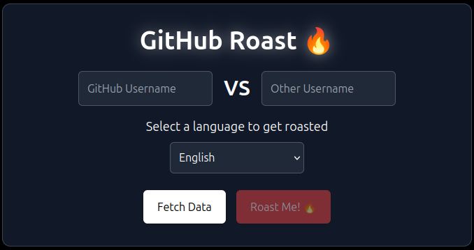
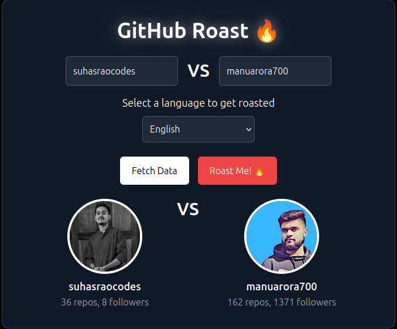
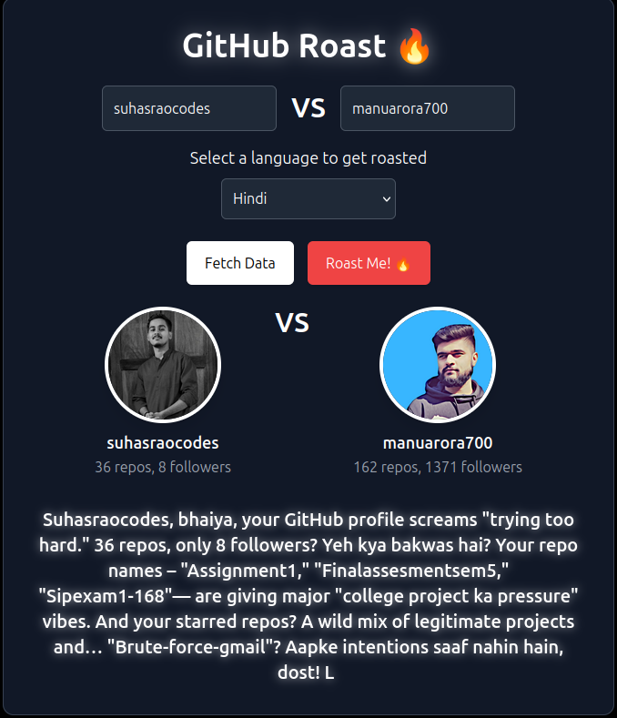

# GitTroll

GitTroll is a fun web application that lets you compare two GitHub users and generate a humorous roast based on their repositories, stars, and followers.

## 🚀 Live Demo
[GitTroll](https://gittroll.vercel.app/)

## 🎯 Features
- Fetches GitHub profile data, repositories, and starred repositories.
- Uses Google's Generative AI (`gemini-1.5-flash`) to generate witty roasts.
- Supports multiple languages (English, Hindi, Kannada).
- Typewriter effect for roast display.
- Hosted on Vercel for fast and easy access.

## 🛠️ Tech Stack
- **Frontend:** React.js, Tailwind CSS
- **Backend:** Node.js, Express.js
- **APIs:** GitHub API, Google Generative AI API
- **Hosting:** Vercel

## 🏗️ Installation
### 1️⃣ Clone the Repository
```sh
git clone https://github.com/suhasraocodes/GitTrollV1.git
cd GitTrollV1
```

### 2️⃣ Install Dependencies
```sh
npm install
```

### 3️⃣ Set Up Environment Variables
Create a `.env` file in the root directory and add:
```sh
REACT_APP_GOOGLE_API_KEY=YOUR_KEY
REACT_APP_GITHUB_TOKEN=YOUR_KEY
```

### 4️⃣ Run the App
```sh
npm start
```

The app will be available at `http://localhost:3000`.

## 🎭 How to Use
1. Enter two GitHub usernames.
2. Select a language for the roast.
3. Click "Fetch Data" to retrieve profile details.
4. Click "Roast Me!" to generate a fun roast.

## 📸 Screenshots




## 📝 License
This project is licensed under the MIT License.

## 🤝 Contributing
Contributions are welcome! Feel free to open an issue or submit a pull request.

## 🌟 Show Your Support
If you like the project, please ⭐ the repository!

---
Made with ❤️ by Suhas.
